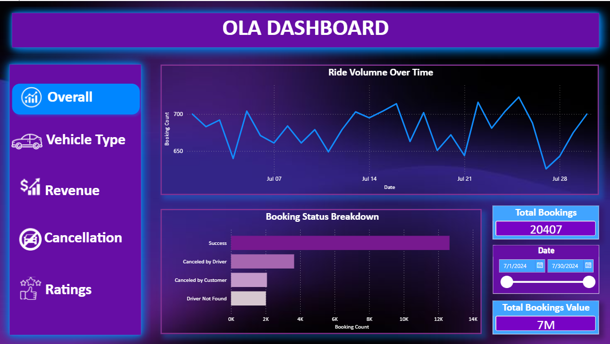
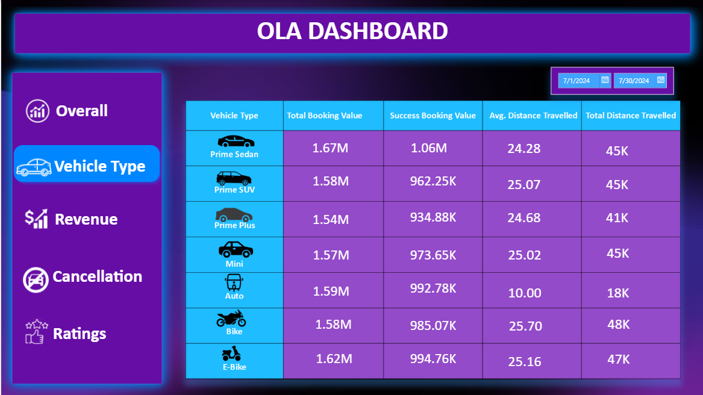
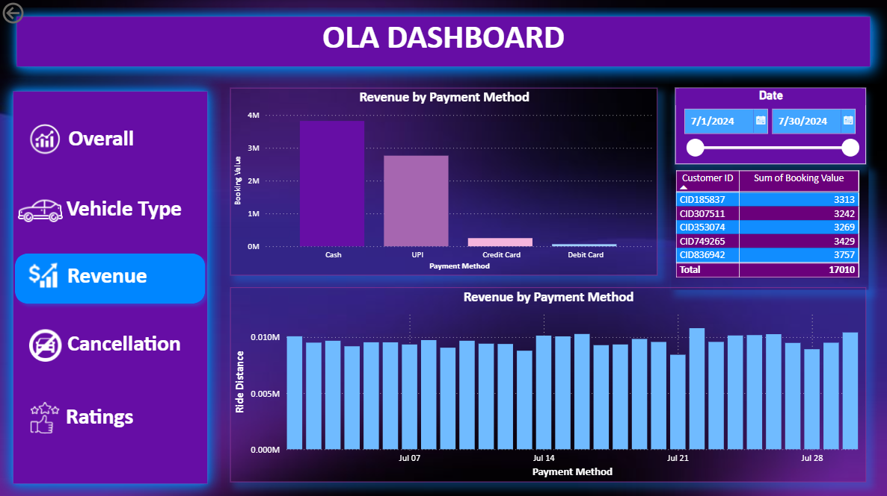
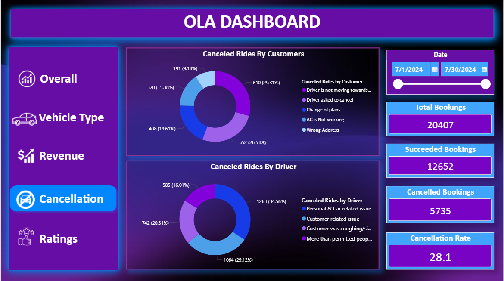

# 🚕 OLA Ride Performance Analytics  
### SQL & Power BI Project

## 📌 Project Overview
This project analyzes **OLA ride booking data** to understand ride performance, revenue trends, vehicle usage, cancellation behavior, and customer satisfaction.  
The analysis is performed using **SQL for data querying** and **Power BI for interactive dashboards**.

The goal of this project is to transform raw ride data into **clear and actionable business insights**.

---

## 🎯 Project Objectives
- Analyze overall ride booking performance
- Track successful, cancelled, and incomplete rides
- Evaluate vehicle-wise performance
- Understand revenue trends and payment methods
- Identify customer and driver cancellation reasons
- Analyze customer and driver ratings
- Support data-driven decision making

---

## 🛠️ Tools & Technologies
- **SQL** – Data analysis and querying  
- **Power BI** – Data visualization and dashboard creation  
- **CSV / Excel** – Data source  

---

## 📂 Dataset Description
The dataset contains OLA ride booking information with the following key attributes:
- Booking date and time  
- Booking status  
- Customer and booking IDs  
- Vehicle type  
- Ride distance  
- Booking value  
- Payment method  
- Cancellation and incomplete ride reasons  
- Customer and driver ratings  

---

## 🧮 SQL Analytical Questions
1. Retrieve all successfully completed ride bookings  
2. Calculate the average ride distance for each vehicle type  
3. Find the total number of rides cancelled by customers  
4. Identify the top five customers based on number of bookings  
5. Calculate rides cancelled by drivers due to personal or vehicle-related issues  
6. Determine maximum and minimum driver ratings for Prime Sedan rides  
7. Retrieve rides where UPI was used as the payment method  
8. Calculate average customer rating for each vehicle type  
9. Compute total booking value from successful rides  
10. List all incomplete rides along with their reasons  

---

## 📊 Power BI Analytical Questions
- How does ride volume change over time?
- What is the booking status distribution?
- Which vehicle types generate the highest booking value?
- Which vehicle types cover the maximum ride distance?
- How does customer rating vary by vehicle type?
- How is revenue distributed by payment method?
- Who are the top customers by booking value?
- What are the main reasons for customer cancellations?
- What are the key reasons for driver cancellations?
- How do customer and driver ratings compare?

---

## 📊 Dashboard Screenshots

### Overall Performance

### Vehicle Performance

### Revenue Analysis

### Cancellation Analysis

### Ratings Analysis

---

## 📈 Key Insights
- Most rides are successfully completed  
- Certain vehicle types generate higher revenue and distance  
- UPI is a widely used payment method  
- Cancellations occur due to both customer and driver-related reasons  
- Higher driver ratings are associated with better customer satisfaction  

---

## 💼 Business Value
This project helps stakeholders:
- Monitor operational performance
- Identify high-performing vehicle categories
- Reduce cancellations through root-cause analysis
- Improve customer experience
- Make data-driven decisions

---

## ✅ Conclusion
The **OLA Ride Performance Analytics** project demonstrates an end-to-end data analytics workflow using SQL and Power BI. It highlights practical analytical skills, business understanding, and the ability to present insights through dashboards.

---

## 📌 Disclaimer
This project was created independently for learning and portfolio purposes using a simulated dataset.

